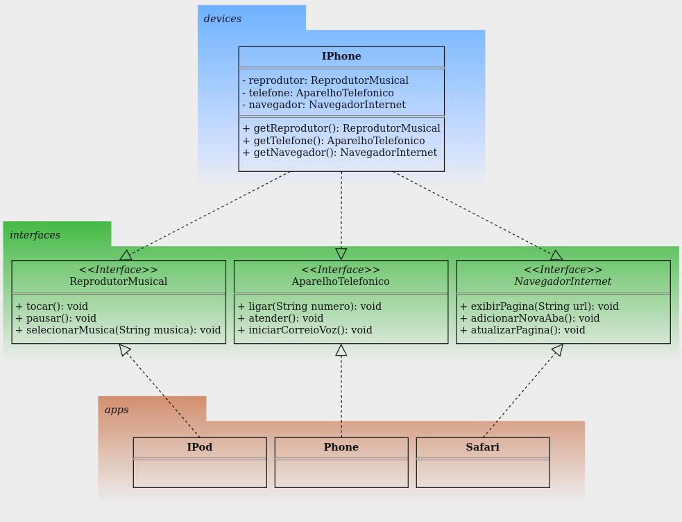

# Desafio - Modelando o iPhone com UML: Funções de Músicas, Chamadas e Internet

Projeto desenvolvido para o Desafio de Projeto do curso "Programação Orientada a Objetos com Java" da [DIO](https://www.dio.me/). O objetivo deste desafio foi modelar e diagramar a representação UML do componente iPhone, abrangendo suas funcionalidades como Reprodutor Musical, Aparelho Telefônico e Navegador de Internet.

## Diagrama UML

## Funcionalidades Modeladas

- **Reprodutor Musical**
    - Métodos: `tocar()`, `pausar()`, `selecionarMusica(String musica)`
- **Aparelho Telefônico**
    - Métodos: `ligar(String numero)`, `atender()`, `iniciarCorreioVoz()`
- **Navegador de Internet**
    - Métodos: `exibirPagina(String url)`, `adicionarNovaAba()`, `atualizarPagina()`

## Vídeo de Referência

Assista ao vídeo de lançamento do iPhone de 2007 para entender as funcionalidades principais.

[Lançamento iPhone 2007](https://www.youtube.com/watch?v=9ou608QQRq8)
